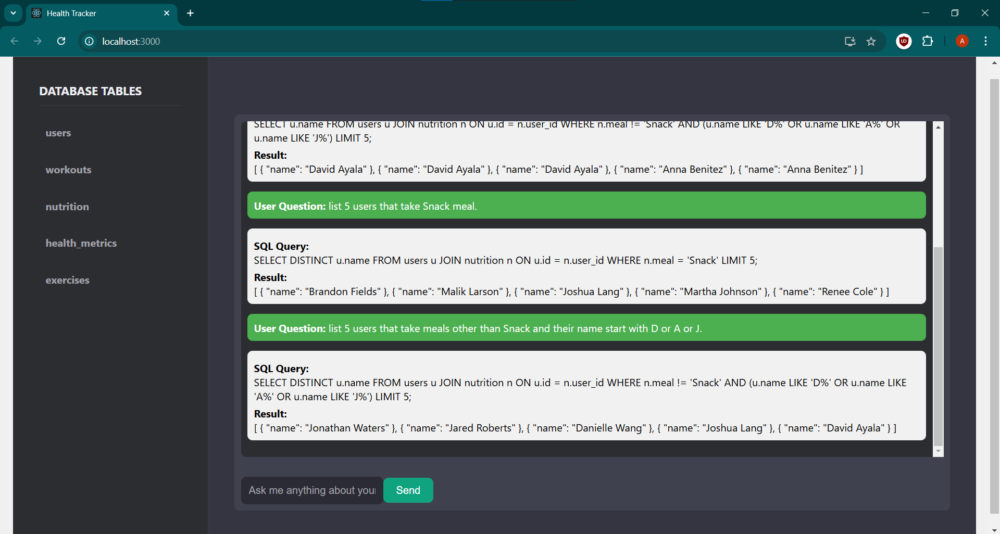

# Health Tracker 

Health Tracker is a web application that allows users to interact with their health data through an intuitive chatbot interface. The app uses a backend powered by FastAPI to dynamically generate SQL queries and fetch results from a PostgreSQL database.
## Features

#### Chatbot Interface:
 Users can ask questions related to their health data.
#### SQL Query Generation: 
The system generates SQL queries based on user input.

#### Database Query Execution: 
The queries are executed against a PostgreSQL database and results are returned to the user.

#### Table Metadata Sidebar: 
View table names and columns from the connected database.
## Prerequisites
Before setting up the project, make sure you have the following installed:

React (for frontend)

npm or yarn (for managing JavaScript packages)

Python (for backend)

PostgreSQL (for the database)

Git (for version control)
## Setup

#### pip install -r requirements.txt
#### run database.py (inside models folder)  
for building database schema
#### run populate_data.py (inside scripts folder) 
this will populate the database.
#### Set up environment variables 
Create a .env file 

DB_USER=your_db_user

DB_PASSWORD=your_db_password 

DB_NAME=your_db_name

DB_HOST=localhost

DB_PORT=5432

#### Start the backend server : uvicorn app:app --reload
#### start the frontend : npm start
## Screenshots
